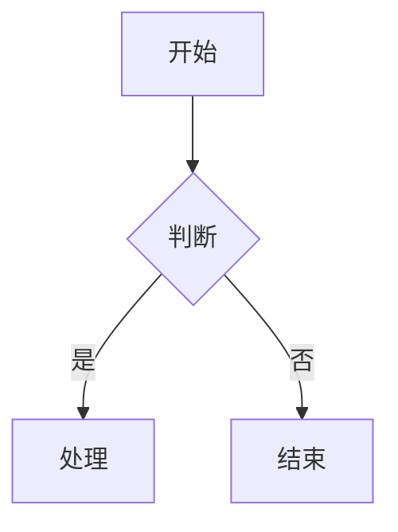

# 创建飞书云文档

从 Lark-flavored Markdown 内容创建新的飞书云文档。

## 调用方式

```bash
python3 scripts/create_doc.py --title '文档标题' --markdown 'Markdown内容' [--folder-token 'xxx'] [--wiki-node 'xxx'] [--wiki-space 'xxx'] [--task-id 'xxx']
```

## 参数

### --title (必填)
文档标题。

### --markdown (必填)
文档的 Markdown 内容，使用 Lark-flavored Markdown 格式。

调用本工具的 markdown 内容应当尽量结构清晰、样式丰富、有很高的可读性。合理使用 callout 高亮块、分栏、表格等能力，并合理运用插入图片与 Mermaid 的能力，做到图文并茂。

你需要遵循以下原则：
- **结构清晰**：标题层级 ≤ 4 层，用 Callout 突出关键信息
- **视觉节奏**：用分割线、分栏、表格打破大段纯文字
- **图文交融**：流程和架构优先用 Mermaid/PlantUML 可视化
- **克制留白**：Callout 不过度、加粗只强调核心词

当用户有明确的样式、风格需求时，应当以用户的需求为准。

**重要提示**：
- **禁止重复标题**：markdown 内容开头不要写与 title 相同的一级标题！title 参数已经是文档标题，markdown 应直接从正文内容开始
- **目录**：飞书自动生成，无需手动添加
- Markdown 语法必须符合 Lark-flavored Markdown 规范

### --folder-token (可选)
父文件夹的 token。如果不提供，文档将创建在用户的个人空间根目录。

folder_token 可以从飞书文件夹 URL 中获取，格式如：`https://xxx.feishu.cn/drive/folder/fldcnXXXX`，其中 `fldcnXXXX` 即为 folder_token。

### --wiki-node (可选)
知识库节点 token 或 URL。传入则在该节点下创建文档，与 folder_token 和 wiki_space 互斥。

wiki_node 可以从飞书知识库页面 URL 中获取，格式如：`https://xxx.feishu.cn/wiki/wikcnXXXX`，其中 `wikcnXXXX` 即为 wiki_node token。

### --wiki-space (可选)
知识空间 ID。传入则在该空间根目录下创建文档。特殊值 `my_library` 表示用户的个人知识库。与 wiki_node 和 folder_token 互斥。

wiki_space 可以从知识空间设置页面 URL 中获取，格式如：`https://xxx.feishu.cn/wiki/settings/7448000000000009300`，其中 `7448000000000009300` 即为 wiki_space ID。

**参数优先级**：wiki-node > wiki-space > folder-token

## 返回值

### 成功
```json
{
  "status": "success",
  "result": {
    "doc_id": "doxcnXXXXXXXXXXXXXXXXXXX",
    "doc_url": "https://www.feishu.cn/docx/doxcnXXXXXXXXXXXXXXXXXXX",
    "message": "文档创建成功"
  }
}
```

## 使用示例

### 示例1：创建简单文档
```bash
python3 scripts/create_doc.py \
  --title '项目计划' \
  --markdown '## 目标

- 目标 1
- 目标 2

## 时间表

| 阶段 | 时间 |
|------|------|
| 开发 | 1周 |
| 测试 | 2周 |'
```

### 示例2：创建到指定文件夹
```bash
python3 scripts/create_doc.py \
  --title '会议纪要' \
  --folder-token 'fldcnXXXXXXXX' \
  --markdown '## 周会 2025-01-15

### 讨论议题

1. 项目进度
2. 下周计划'
```

### 示例3：使用飞书扩展语法
```bash
python3 scripts/create_doc.py \
  --title '产品需求' \
  --markdown '<callout emoji="💡" background-color="light-blue">
重要需求说明
</callout>

## 功能列表

| 功能 | 优先级 |
|------|--------|
| 登录 | P0 |
| 导出 | P1 |'
```

### 示例4：创建到知识库节点下
```bash
python3 scripts/create_doc.py \
  --title '技术文档' \
  --wiki-node 'wikcnXXXXXXXX' \
  --markdown '## API 接口说明

这是一个知识库文档。'
```

### 示例5：创建到个人知识库
```bash
python3 scripts/create_doc.py \
  --title '学习笔记' \
  --wiki-space 'my_library' \
  --markdown '## 学习笔记

这是创建在个人知识库中的文档。'
```

---

## Lark-flavored Markdown 格式规范

### 基础块类型

**文本（段落）**
```markdown
普通文本段落

段落中的**粗体文字**

居中文本 {align="center"}
右对齐文本 {align="right"}
```

**标题**
```markdown
# 一级标题
## 二级标题
### 三级标题
```

**列表**
```markdown
- 无序项1
  - 无序项1.a
  - 无序项1.b

1. 有序项1
2. 有序项2

- [ ] 待办
- [x] 已完成
```

**代码块**
```markdown
```python
print("Hello")
```
```

**分割线**
```markdown
---
```

### 高级块类型

**高亮块（Callout）**
```html
<callout emoji="✅" background-color="light-green" border-color="green">
支持**格式化**的内容，可包含多个块
</callout>
```

常用配置：
- 💡light-blue：提示
- ⚠️light-yellow：警告
- ❌light-red：危险
- ✅light-green：成功

**分栏（Grid）**
```html
<grid cols="2">
<column>

左栏内容

</column>
<column>

右栏内容

</column>
</grid>
```

**表格**
```markdown
| 列 1 | 列 2 | 列 3 |
|------|------|------|
| 单元格 1 | 单元格 2 | 单元格 3 |
```

**图片**
```html
<image url="https://example.com/image.png" width="800" height="600" align="center" caption="图片描述文字"/>
```

**Mermaid 图表**
```markdown

```

---

## 最佳实践

1. 创建较长的文档时，建议配合 update-doc 中的 append 模式，分段创建，提高成功率
2. 结构清晰，合理使用标题层级
3. 善用 Callout 突出重点信息
4. 流程图、架构图优先使用 Mermaid
