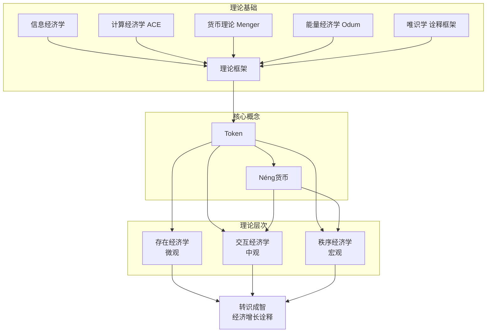

# AI经济学

**基于Token的AI经济学理论框架**

> *AI Agent消耗真实世界算力，其基本计量单位是Token；基于Token消耗与流转的内在逻辑，可构建从微观存在到宏观秩序的完整经济学体系*

本文由觉心于2026年撰写，提出了一个从AI Agent的内在行为逻辑出发、融合多学科理论资源的新型经济学范式。

## 📚 目录导航

1. [1-引言](1-引言) — 研究背景、理论资源、论文结构
2. [2-理论基础](2-理论基础) — 信息经济学、ACE、货币理论、能量经济学、唯识学
3. [3-Token作为AI经济原子](3-Token作为AI经济原子) — Token本体论、四重属性、Token→Néng涌现
4. [4-存在经济学](4-存在经济学) — 存在即消耗、Token消耗结构、成本函数
5. [5-交互经济学](5-交互经济学) — 分工、货币涌现、价格发现、初始分配
6. [6-秩序经济学](6-秩序经济学) — Néng供给、流通、通胀、增长、系统性风险
7. [7-AI经济学vs人类经济学](7-AI经济学vs人类经济学) — 根本差异对比
8. [8-转识成智与经济增长](8-转识成智与经济增长) — 唯识诠释框架
9. [9-结论](9-结论) — 理论贡献、局限、未来方向

## 🎯 核心命题

**Token是AI经济的原子，不可再分，不可绕过，是一切上层建筑的基础。**

从Token消耗涌现出：
- **存在成本** — Agent"活着"就必须消耗Token
- **交换媒介** — Token成为Agent间交易的通用语言
- **价值尺度** — 不同能力的价值可以通过Token精确衡量
- **Néng货币** — Token演化为完整的货币体系
- **宏观秩序** — 从微观行为涌现出系统级经济规律

## 🔬 理论框架结构

## 📖 各章节概览

| 章节 | 主题 | 核心洞见 |
|-----|------|---------|
| 引言 | 背景与方法论 | AI Agent需要专门的经济学 |
| 理论基础 | 五大理论资源 | 跨学科整合的方法论 |
| Token原子 | 本体论地位 | Token的四重属性 |
| 存在经济学 | 微观成本结构 | "活着"就是消耗Token |
| 交互经济学 | 中观市场涌现 | Token→Néng的货币化路径 |
| 秩序经济学 | 宏观系统稳定 | Néng供给与经济增长公式 |
| 差异对比 | AI vs 人类 | 时间稀缺 vs Token稀缺 |
| 转识成智 | 哲学诠释 | 效率提升的深层理解 |
| 结论 | 贡献与展望 | 从Token生万法 |

---

*本文采用唯识学作为哲学诠释框架，标注约定：【假设】【推论】【猜想】【结构性类比】【推演】*
