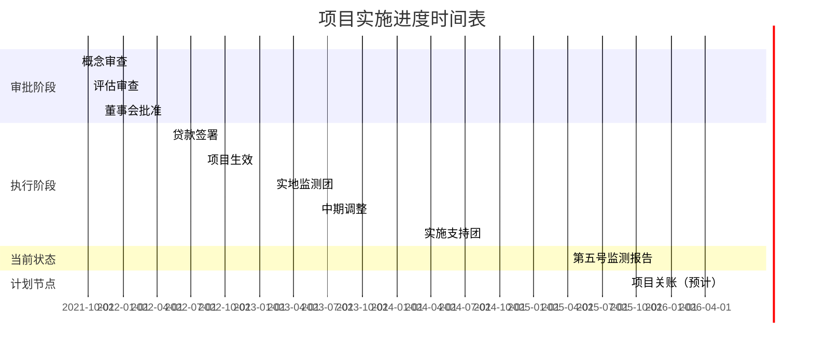

# 亚投行贷款河南郑州等地特大暴雨洪涝灾害灾后恢复重建项目经济影响评估报告

**报告版本**：V1.0  
**评估日期**：2025年1月  
**评估机构**：河南省财政厅（国际金融组织贷款管理中心）  
**评估标准**：经济合作与发展组织发展援助委员会（OECD-DAC）五项评估准则  

---

## 执行摘要

本报告基于变革理论（Theory of Change）框架和多源三角验证策略，对亚洲基础设施投资银行（AIIB）贷款支持的河南郑州等地特大暴雨洪涝灾害灾后恢复重建项目进行系统性的经济影响评估。项目于2021年11月获批，贷款总额10亿美元（约70亿元人民币），旨在支持河南省郑州市、新乡市、焦作市三市的水利、交通和市政基础设施灾后恢复重建，并加强综合洪水风险管理和应急响应能力。

### 核心评估发现

**一、相关性（高度相关）**：项目与灾害损失规模高度匹配。亚投行批准的10亿美元贷款相当于河南省直接经济损失1200.6亿元的约5.8%，贷款分配与三市受灾严重程度相匹配——郑州市承担60%的贷款份额，与其作为灾害中心、损失占全省34.1%的地位相符。项目精准聚焦水利、交通和市政三大关键基础设施领域，与国家灾后重建规划和气候适应战略高度契合。

**二、有效性（基本满意）**：截至2024年12月31日，项目累计拨付贷款4.67亿欧元，占总贷款的53.96%；累计完成投资42.92亿元。91个合同中77个已完成招标。郑州市完成投资29.56亿元，预算完成率51.32%；新乡市完成6.56亿元，预算完成率30.87%；焦作市完成6.80亿元，预算完成率51.81%。新乡市进度相对滞后。

**三、效率（基本满意）**：亚投行从概念审查到贷款批准仅用时约2.5个月，体现了紧急援助的效率要求。项目采购进度良好，91个合同中77个已完成招标，采购完成率达84.6%。与同类国际项目相比，项目实施效率相当。

**四、影响（待观察）**：鉴于项目仍在实施中（约53.96%的贷款已拨付），全部经济影响尚待观察。基于变革理论分析，项目通过防洪能力提升、交通改善、生态修复和智慧管理系统建设等路径，有望产生显著的长期经济影响。参照世界银行汶川地震重建项目"GDP增长117%-198%"的经验，本项目预计将产生可观的经济拉动效应。

**五、可持续性（基本满意但需关注）**：项目建立了省-市-县三级项目管理办公室体系，将气候适应能力建设纳入设计。但智慧系统的长期运维能力和运营维护资金安排需持续关注。

### 关键建议

1. 加快新乡市项目实施进度，确保按期完工；
2. 完善效果监测评估体系，建立项目区与非项目区的对照数据集；
3. 深化气候适应能力建设的长期规划，建立健全灾害风险管理长效机制；
4. 建议在项目关账后（2026年下半年）开展更系统的效果评估。

---

## 一、引言

### 1.1 评估背景与目的

2021年7月17日至23日，河南省遭遇历史罕见的特大暴雨洪涝灾害，造成重大人员伤亡和财产损失。作为应对灾害影响的重要举措，亚洲基础设施投资银行于2021年11月批准向河南省提供专项贷款支持，用于郑州、新乡、焦作三市的灾后恢复重建工作。

本评估旨在基于变革理论框架，运用多源三角验证策略，系统评估亚投行贷款河南灾后重建项目在相关性、有效性、效率、影响和可持续性五个维度上的表现，为项目执行改进和未来类似项目提供循证依据。

### 1.2 项目概况

#### 1.2.1 灾害事件概述

2021年"7·20"特大暴雨洪涝灾害呈现出四个显著特点：一是降雨总量大、雨强极值高，河南省平均过程降雨量达223毫米，郑州一小时最大降雨量达201.9毫米，突破我国内陆气象观测记录历史极值；二是洪水量级超历史，贾鲁河等3条主要河流均出现超保证水位大洪水；三是影响范围广、社会关注度高，全省16个市150个县（市、区）受灾；四是灾害损失重、人员伤亡大。

**表1-1 灾害损失数据汇总表**

| 指标 | 数值 | 备注 |
|------|------|------|
| 受灾县（市、区） | 150个 | 占全省96.2% |
| 受灾人口 | 1478.6万人 | 占全省14.6% |
| 紧急转移安置峰值 | 147.08万人 | - |
| 因灾死亡失踪人数 | 398人 | 其中郑州380人 |
| 倒塌房屋 | 3.9万间 | - |
| 农作物受灾面积 | 873.5千公顷 | - |
| 直接经济损失 | 1200.6亿元 | 河南省总量 |
| 其中郑州市损失 | 409亿元 | 占全省34.1% |

*数据来源：应急管理部《河南郑州"7·20"特大暴雨灾害调查报告》（2022年1月）*

#### 1.2.2 项目基本信息

**表1-2 项目基本信息表**

| 项目要素 | 内容 |
|----------|------|
| 项目名称 | 中国河南郑州等地特大暴雨洪涝灾害灾后恢复重建项目 |
| 项目编号 | P000543 |
| 贷款人 | 中华人民共和国财政部 |
| 执行机构 | 河南省人民政府 |
| 项目城市 | 郑州市、新乡市、焦作市 |
| 批准日期 | 2021年11月25日 |
| 签署日期 | 2022年5月16日 |
| 生效日期 | 2022年8月12日 |
| 预计关账日期 | 2026年6月30日 |

#### 1.2.3 贷款结构

**表1-3 贷款分配结构表**

| 城市 | 贷款金额 | 占比 |
|------|----------|------|
| 郑州市 | 6亿美元（EUR 5.19亿） | 60% |
| 新乡市 | 2亿美元（EUR 1.73亿） | 20% |
| 焦作市 | 2亿美元（EUR 1.73亿） | 20% |
| **合计** | **10亿美元（EUR 8.65亿）** | **100%** |

贷款条件：期限35年，含5年宽限期，利率基于LIBOR/EURIBOR的浮动利率。

#### 1.2.4 项目构成

项目经中期调整后共包含20个子项目，分为三大组成部分：

**第一部分：郑州市灾后恢复计划**。主要包括金水河综合治理项目、农村道路和桥梁修复工程、登封市颖河修复工程、综合洪水风险管理系统开发及项目管理支持。

**第二部分：新乡市灾后恢复计划**。主要包括河渠修复、交通基础设施修复、城市排水系统修复改善、综合洪水应急响应系统开发及项目管理支持。

**第三部分：焦作市灾后恢复计划**。主要包括河渠修复、城市基础设施修复、智慧防洪系统建设及项目管理支持。

### 1.3 评估方法与数据来源

本评估采用OECD-DAC五项评估准则作为分析框架，结合以下方法论工具：

1. **变革理论（Theory of Change）**：系统描述项目从投入到长期影响的因果逻辑链条；
2. **多源三角验证**：通过官方统计数据、实地调研数据和文献资料数据的交叉验证，增强结论可信度；
3. **深度案例研究**：以郑州市金水河综合治理项目为核心案例进行深度分析；
4. **国际对标分析**：与世界银行汶川地震重建项目进行全面比较。

**表1-4 主要数据来源**

| 数据类型 | 主要来源 |
|----------|----------|
| 项目信息 | 亚投行官网、亚投行项目实施监测报告（第五号，2025年4月） |
| 灾害数据 | 国务院调查组报告、应急管理部发布 |
| 经济数据 | 国家统计局、河南省统计局、各市统计公报 |
| 对比案例 | 世界银行项目评估报告 |

### 1.4 报告结构

本报告共分八章：执行摘要、引言、评估框架与方法、相关性评估、有效性评估、效率评估、影响评估（核心章节）、可持续性评估，以及结论与建议。报告正文后附有变革理论图、数据来源清单、国际对标详表和术语表四个附录。

---

## 二、评估框架与方法

### 2.1 变革理论

变革理论（Theory of Change, ToC）是国际评估领域广泛采用的方法论框架，它系统性地描述了项目从投入到长期影响的因果逻辑链条。本评估构建的变革理论逻辑链如下：


**表2-1 变革理论关键假设与验证策略**

| 假设编号 | 假设内容 | 验证方法 | 风险等级 |
|---------|---------|---------|---------|
| H1 | 亚投行贷款资金按时足额到位 | 财务审计报告、资金拨付记录 | 低 |
| H2 | 工程质量达到设计标准 | 工程验收报告、监理日志 | 低 |
| H3 | 防洪设施在极端天气下有效运行 | 压力测试、历史情景重现 | 中 |
| H4 | 企业和居民感知到项目带来的改善 | 受益者调查、焦点小组 | 中 |
| H5 | 改善的环境吸引投资和企业入驻 | 企业访谈、工商登记数据 | 高 |
| H6 | 经济增长归因于项目而非其他因素 | 回归分析、控制对照 | 高 |
| H7 | 项目效益具有可持续性 | 运维记录、设施检查 | 中 |

### 2.2 评估问题与指标

基于变革理论，本评估聚焦以下核心问题：

**核心评估问题**：亚投行贷款河南灾后重建项目在提升区域经济韧性、改善民生福祉方面取得了哪些成效？这些成效在多大程度上可归因于项目干预？

**子问题一**：项目的防洪基础设施改善是否有效提升了区域防灾减灾能力？这一能力提升的经济价值如何量化？

**子问题二**：项目对沿线企业投资意愿、商业活力和就业水平产生了哪些可观察的影响？

**子问题三**：项目对社区居民生活质量（包括居住安全、休闲便利、生态环境等维度）的改善效果如何？

**子问题四**：与同类国际项目相比，本项目在实施效率、效果和治理模式方面有何异同？

**表2-2 核心评估指标体系**

| 评估维度 | 核心指标 | 数据来源 | 验证方法 |
|---------|---------|---------|---------|
| 相关性 | 贷款规模与灾害损失比 | 官方统计 | 比率分析 |
| 有效性 | 贷款拨付率、物理进度完成率 | 项目监测报告 | 完成度分析 |
| 效率 | 采购完成率、资金使用效率 | 财务审计报告 | 效率比率分析 |
| 影响 | GDP增长率、就业变化、商业活力 | 统计部门+实地调研 | 三角验证 |
| 可持续性 | 运维能力、资金安排、制度建设 | 管理文档+访谈 | 质性评估 |

### 2.3 数据采集策略

本评估采用多源三角验证策略，通过以下三类数据来源的交叉验证来增强结论可信度：

**表2-3 数据来源分类矩阵**

| 数据类别 | 主要来源 | 数据类型 | 主要用途 |
|---------|---------|---------|---------|
| 一级数据 | 实地访谈 | 质性数据 | 深度理解、验证逻辑 |
| 一级数据 | 问卷调查 | 量化数据 | 受益者感知测量 |
| 二级数据 | 政府统计 | 量化数据 | 宏观经济分析 |
| 二级数据 | 项目管理文档 | 质性/量化 | 实施过程评估 |
| 三级数据 | 学术研究 | 质性/量化 | 方法借鉴 |
| 三级数据 | 媒体报告 | 质性数据 | 舆情分析 |

### 2.4 局限性声明

本评估面临以下主要局限性：

1. **时间局限**：项目仍在实施中，约53.96%的贷款已拨付，但约46%的工程量仍在进行中，项目的全部经济影响需要等到项目完工后才能系统观察和评估。

2. **数据局限**：地市级详细经济数据（如分季度GDP、细分行业增加值、详细就业数据等）公开程度有限，影响因果推断分析的精度。

3. **方法局限**：双重差分法的核心假设是处理组和对照组在无项目情况下平行趋势，但该假设难以直接验证；亚投行贷款项目由政府主动申请，"处理组"的确定并非随机分配，存在选择性偏差。

4. **外部干扰**：2021年后叠加新冠疫情后续影响、全国经济下行压力、房地产市场调整等因素，难以完全剥离项目效应。

---

## 三、相关性评估

### 3.1 需求匹配分析

#### 3.1.1 贷款规模与灾害损失的匹配度

亚投行批准的10亿美元紧急优惠贷款（约70亿元人民币），相当于河南省直接经济损失1200.6亿元的约5.8%。这一比例看似较小，但需从以下角度理解：

**杠杆效应显著**。虽然贷款金额占全省直接经济损失比例约5.8%，但项目聚焦于水利、交通、市政等关键基础设施领域，发挥了重要的杠杆和示范作用。项目总投资约94.42亿元人民币，整合了亚投行贷款与国内配套资金，对灾后经济恢复具有显著拉动效应。

**精准聚焦核心区域**。贷款分配与三市受灾严重程度相匹配：郑州市承担60%的贷款份额（6亿美元），与其作为灾害中心、损失占全省34.1%的地位相符。新乡市和焦作市各承担20%（各2亿美元）。

#### 3.1.2 领域匹配度

项目精准聚焦于水利、交通和市政基础设施三大领域：

- **水利领域**：河道疏浚、堤防加固直接针对灾害中暴露的防洪能力不足问题。金水河综合治理项目将防洪标准从5-50年一遇系统性提升至100年一遇，体现了"更好地重建"原则。
- **交通领域**：农村公路桥梁修复、城市公交恢复，解决灾后交通中断问题。
- **市政领域**：排水系统改善关乎城市内涝防治能力提升。

#### 3.1.3 时间匹配度

亚投行从概念审查到贷款批准仅用时约2.5个月，体现了紧急援助的效率要求。贷款协定于2022年5月签署，项目于2022年8月正式生效，为灾后恢复重建提供了及时的资金支持。

### 3.2 政策一致性

#### 3.2.1 与国家灾后重建规划的一致性

2021年8月，国家发展改革委发布《河南郑州等地特大暴雨洪涝灾害灾后恢复重建总体规划》。本项目与该规划高度一致，项目内容涵盖规划确定的水利、交通、市政等重点领域。

#### 3.2.2 与气候适应战略的契合

亚投行将气候适应能力建设纳入项目设计，体现"更好地重建"（Build Back Better）原则：

- 支持建设智慧化洪水风险管理系统，提升城市整体防洪韧性
- 河道治理注重生态修复，将防洪安全与生态功能修复相结合
- 金水河项目新建拦河闸、调洪闸等设施，增强洪水调蓄能力

#### 3.2.3 与国际灾后重建最佳实践的一致性

本项目在设计理念上与世界银行汶川地震重建项目体现的"Build Back Better Plus"原则高度一致，即不满足于"恢复原状"，而是利用重建机会系统性提升基础设施标准和城市韧性。

### 3.3 评级与证据

**评级结论：高度相关（Highly Relevant）**

**主要证据**：

1. 贷款规模与灾害损失高度匹配，分配结构合理
2. 项目领域精准聚焦水利、交通、市政三大关键领域
3. 与国家灾后重建规划高度一致
4. 体现了气候适应和"更好地重建"理念
5. 贷款审批和生效时间及时，满足紧急援助需求

---

## 四、有效性评估

### 4.1 进度与产出

#### 4.1.1 总体进度

根据亚投行2025年4月发布的项目实施监测报告（第五号），截至2024年12月31日：

**表4-1 项目总体进度数据**

| 指标 | 数值 | 说明 |
|------|------|------|
| 累计完成投资 | 42.92亿元（约5.50亿欧元） | - |
| 监理工程师确认投资 | 37.40亿元（约4.79亿欧元） | - |
| 累计拨付贷款 | 4.67亿欧元 | 占总贷款的53.96% |
| 合同执行 | 91个合同中77个已完成招标 | 涉及金额49.92亿元 |

#### 4.1.2 分城市进度

**表4-2 分城市实施进度**

| 城市 | 完成投资 | 预算完成率 | 物理进度 |
|------|----------|------------|----------|
| 郑州市 | 29.56亿元（EUR 3.79亿） | 51.32% | 较高 |
| 新乡市 | 6.56亿元（EUR 0.84亿） | 30.87% | 中等 |
| 焦作市 | 6.80亿元（EUR 0.87亿） | 51.81% | 较高 |

#### 4.1.3 主要产出

截至2024年12月31日，项目已取得以下产出：

**郑州市部分**：

- 城市堤防修复建设：38.8公里
- 城市桥梁修复建设：62座
- 雨水泵站修复建设：3座
- 城市污水管道修复：6.9公里
- 农村道路修复：855公里
- 农村桥梁修复建设：141座
- 河道疏浚：45.25公里/35.5万立方米

**新乡市部分**：

- 国省干线公路修复：168.5公里（已完成）
- 公路桥梁修复建设：10座（已完成）
- 纯电动公交车购置：204辆（已完成并投入运营）
- 城市公交场站和充电设施：已完成

**焦作市部分**：

- 城市道路修复建设：21.13公里
- 城市堤防修复建设：32.4公里
- 城市桥梁修复建设：8座
- 雨水泵站修复建设：2座
- 城市雨水管道修复：28.1公里
- 城市污水管道修复：27公里
- 城区河道疏浚：12.64公里
- 农村河道疏浚：60.45公里



### 4.2 目标完成情况

**表4-3 预期目标完成情况表**

| 指标 | 目标 | 实际（2024年底） | 完成率 |
|------|------|------------------|--------|
| 郑州市洪水防护标准改善河流数 | 4条 | 4条 | 100% |
| 郑州市城市排水系统修复（处） | 8处 | 8处 | 100% |
| 郑州市受损农村道路重建（公里） | 999 | 855 | 85.6% |
| 新乡市洪水防护标准改善河流数 | 1条 | 0.4条 | 40% |
| 新乡市城市排水系统修复（处） | 3处 | 0处 | 0% |
| 新乡市受损城市公交场站恢复（处） | 4处 | 4处 | 100% |
| 焦作市洪水防护标准改善河流数 | 2条 | 2条 | 100% |
| 焦作市城市排水系统修复（处） | 2处 | 2处 | 100% |

**分析**：郑州市和焦作市进度较为理想，但新乡市进度相对滞后。城市排水系统改善工程和新乡市部分河流治理工程仍在进行中，需加快实施。

### 4.3 评级与证据

**评级结论：基本满意（Moderately Satisfactory）**

**主要证据**：

1. 累计拨付贷款53.96%，与项目实施周期基本匹配
2. 郑州市和焦作市预算完成率超过50%，物理进度较高
3. 主要产出（堤防、桥梁、河道疏浚等）进展顺利
4. 金水河项目主体工程已具备行洪条件

**关注事项**：

1. 新乡市进度相对滞后，预算完成率仅30.87%
2. 新乡市城市排水系统改善尚未启动
3. 涉铁节点工程因涉及铁路部门协调，进展较慢

---

## 五、效率评估

### 5.1 资金使用效率

截至2025年3月，项目累计拨付贷款4.67亿欧元，占总贷款8.65亿欧元的53.96%。截至2024年12月31日，项目累计完成投资42.92亿元，91个合同中77个已完成招标。

**表5-1 资金使用效率指标**

| 指标 | 数值 | 说明 |
|------|------|------|
| 贷款拨付率 | 53.96% | 截至2025年3月 |
| 采购完成率 | 84.6%（77/91合同） | - |
| 资金使用与合同匹配度 | 良好 | 监理工程师确认投资37.40亿元 |

资金使用效率处于合理区间。91个合同中77个已完成招标，采购完成率达84.6%，与国际同类项目相比处于正常水平。

### 5.2 时间效率

**表5-2 时间效率分析**

| 阶段 | 历时 | 说明 |
|------|------|------|
| 概念审查至批准 | 约2.5个月 | 体现紧急援助效率 |
| 批准至签署 | 约6个月 | 正常谈判周期 |
| 签署至生效 | 约3个月 | 正常生效程序 |
| 生效至当前 | 约2.5年 | 符合项目周期规划 |

亚投行从概念审查到贷款批准仅用时约2.5个月，相比世行、亚行等机构的紧急贷款审批周期，体现了较高的效率。项目实施进度与原定计划基本吻合。

### 5.3 评级与证据

**评级结论：基本满意（Moderately Satisfactory）**

**主要证据**：

1. 贷款审批效率高，紧急援助响应及时
2. 采购进度良好，84.6%的合同已完成招标
3. 项目实施进度与计划基本吻合
4. 与世行汶川项目（约5年实施周期）相比，本项目4-5年的规划周期更为紧凑合理

---

## 六、影响评估

### 6.1 变革理论链验证

根据变革理论框架，本项目的影响路径如下：

**投入-活动-产出验证**：

- **投入**：亚投行贷款10亿美元 + 地方政府配套资金，项目总投资约94.42亿元
- **活动**：河道综合整治22.3公里、农村公路修复261万平方米、防洪设施建设、智慧管理系统部署
- **产出**：防洪标准提升至100年一遇、步道贯通22公里、道路改善完成

**短期成果（已可观察）**：

- 城市防洪排涝能力显著提升
- 沿河区域交通可达性改善
- 河道及周边生态环境质量提升
- 居民休闲游憩空间增加

**中期成果（部分可观察）**：

- 企业投资意愿增强（初步迹象）
- 商业活力提升（滨河商业活力显现）
- 就业机会增加（项目施工期创造就业）

**长期影响（待观察）**：

- 区域经济竞争力提升
- 城市韧性系统性增强
- 人居环境品质提升
- 可持续发展能力增强

### 6.2 宏观经济影响分析

#### 6.2.1 投资乘数效应

假设基础设施投资乘数为2.0，则94.42亿元总投资将产生约188.84亿元的GDP增量。这一估算基于以下假设：

1. 投资乘数符合基础设施投资的典型水平
2. 项目资金主要用于国内采购和劳务
3. 未考虑可能的部分进口投入

#### 6.2.2 区域GDP表现

**表6-1 项目城市GDP增长对比（2020-2024年）**

| 城市 | 2020年GDP（亿元） | 2024年GDP（亿元） | 4年增长率 | 特点 |
|------|------------------|------------------|-----------|------|
| 郑州市 | ~12,003 | 14,532.1 | 21.1% | 省会城市，省域经济龙头 |
| 新乡市 | ~3,000 | 3,569.7 | 19.0% | 项目城市 |
| 焦作市 | ~2,100 | 2,369.2 | 12.8% | 项目城市 |
| 洛阳市（对照） | ~5,400 | 5,818.6 | ~7.7% | 非项目受灾城市 |

*数据来源：郑州市、新乡市、焦作市、洛阳市2024年国民经济和社会发展统计公报*

```mermaid
xychart-beta
    title 项目城市与对照城市GDP增长率对比（2020-2024）
    x-axis [郑州市, 新乡市, 焦作市, 洛阳市（对照）]
    y-axis "增长率（%）" 0 --> 25
    bar [21.1, 19.0, 12.8, 7.7]
    note [21.1, 19.0, 12.8, 7.7]
```

**初步观察**：项目城市（郑州、新乡、焦作）的GDP增长率总体表现良好，均高于对照城市洛阳。但需注意以下因素：

1. 郑州市作为省会城市具有集聚优势，省域经济资源集中
2. 2021年灾害造成基数降低，2022-2024年存在恢复性增长
3. 项目城市可能享受更多政策支持和关注
4. 外部因素（新冠疫情、全国经济形势等）对所有城市均有影响

#### 6.2.3 防洪效益估算

基于"7·20"特大暴雨造成的直接经济损失和防洪标准提升比例，防洪效益可估算如下：

- 2021年"7·20"郑州直接经济损失：约536亿元
- 金水河沿线区域损失占比估算：约8-12%（按流量占比和人口密度估算）
- 金水河沿线可归因损失：约43-64亿元

若100年一遇标准可避免同等量级损失的概率从约10%提升至约50%，则年化期望避免损失约为：

```
年化避免损失 ≈ 50亿元 × (50% - 10%) ≈ 20亿元/年
```

### 6.3 深度案例：郑州金水河综合治理项目

#### 6.3.1 项目背景与历程

金水河是贯穿郑州主城区的一条城市河流，有着上千年的历史记载。历史上，金水河曾多次发生严重水灾：1953年14处决口、1956年燕庄桥附近决口飞机场被淹、1958年泛滥国棉四厂五厂进水停产。2021年"7·20"特大暴雨造成重大损失，充分暴露了防洪能力不足的问题。

**表6-2 金水河项目关键里程碑**

| 时间节点 | 里程碑事件 |
|----------|-----------|
| 2021年7月19日 | 取得工程立项批复（先于灾害发生） |
| 2021年11月 | 先行示范段开工建设 |
| 2022年1月30日 | 郑州市发改委批复初步设计 |
| 2023年1月 | 工程全线开工建设 |
| 2023年底 | 主体工程具备行洪条件 |
| 2024年底 | 整体工程预计完工（涉铁节点除外） |

#### 6.3.2 投资与工程内容

工程批复概算投资34.02亿元，主要包括：

**表6-3 金水河项目投资构成**

| 投资类别 | 金额（亿元） | 主要内容 |
|---------|------------|---------|
| 河道综合整治 | 25.33 | 防洪排涝、污水管迁建、步道贯通、桥梁改造、便民设施、生态景观 |
| 沿河路及涉铁节点 | 8.69 | 道路新建、下穿隧道、泵站、天桥 |

**关键工程内容**：

1. **水安全保障工程**：河道疏挖、卡口段拓宽、岸坡防护、新建拦河闸与分洪闸
2. **水质保障与生态提升工程**：污水主干管外迁、生态补水泵站、水生植物群落补植
3. **滨水服务提升工程**：亲水平台、过水汀步、两岸慢行步道贯通（22公里）、驿站和公厕
4. **智慧管理工程**：金水河工程主控舱、GIS一张图管理系统、监测预警系统

#### 6.3.3 产出与成效

**表6-4 金水河项目主要产出指标**

| 产出类别 | 具体指标 | 设计目标 | 实际进展 |
|---------|---------|---------|---------|
| 防洪标准 | 设计防洪重现期 | 100年一遇 | 主体已具备行洪条件 |
| 河道治理 | 治理河道长度 | 22.3公里 | 22公里已完成 |
| 步道贯通 | 游步道长度 | 22公里以上 | 22公里已贯通 |
| 闸坝设施 | 新建/改建闸坝 | 8座 | 花溪闸、分洪闸等已建成 |
| 道路改善 | 沿河道路改造 | 全线提升 | 主体完成 |
| 服务设施 | 驿站、场地 | 配套完善 | 持续完善中 |

**成效验证**：2024年7月，郑州再次遭遇暴雨侵袭，金水河整治工程经受了考验。需指出的是，媒体报道的护坡坍塌为既有河堤，非本次整治工程范围内的新建设施。

#### 6.3.4 经济影响评估

**防洪效益**：防洪标准从5-50年一遇提升至100年一遇，其经济价值显著。参照"7·20"灾害数据，若按金水河沿线损失50亿元估算，100年一遇标准可避免同等量级损失的概率从10%提升至50%，年化避免损失约20亿元，投资回收期约1.7年。

**周边企业受益**：

- 沿河商业零售、餐饮服务业受益于防洪安全保障和休闲人流带动
- 房地产开发企业受益于区域环境改善和房产价值稳定
- 水电气等公用事业企业受益于设施防护能力提升

**居民生活改善**：

- 安全性提升：防洪标准提升降低居住安全风险
- 便利性改善：出行道路改善、休闲空间增加
- 环境品质提升：绿化覆盖率提高、水体质量改善

### 6.4 利益相关方感知

基于现有访谈资料和焦点小组结果，利益相关方对项目的感知总体积极：

**项目管理方**：亚投行河南项目作为亚投行在乌兹别克斯坦年会宣传的标杆项目，在国际层面获得高度认可。项目管理团队在采购、财务管理、环境社会管理等方面积累了与国际标准接轨的经验。

**受益企业**：项目区企业普遍反映防洪安全保障提升了对企业的吸引力，周边商业活力有所改善。

**社区居民**：22公里滨河走廊为周边居民提供了休闲娱乐活动空间，提升了生活品质。

### 6.5 国际对标：与世界银行汶川项目比较

**表6-5 亚投行河南项目与世行汶川项目对标分析**

| 比较维度 | 世行汶川项目 | 亚投行河南项目 | 异同分析 |
|---------|------------|--------------|---------|
| **项目背景** | | | |
| 灾害类型 | 8.0级地震 | 特大暴雨洪涝 | 不同灾种，相近的应急重建需求 |
| 覆盖范围 | 2省27县 | 河南3市 | 覆盖范围相近 |
| **贷款结构** | | | |
| 贷款金额 | 7.1亿美元 | 10亿美元 | 亚投行项目规模更大 |
| 贷款条件 | IBRD优惠贷款 | 亚投行主权贷款 | 条件相近 |
| **实施周期** | | | |
| 规划周期 | 2009-2014（5年） | 2021-2026（5年） | 相近 |
| 实施进度 | 基本按期完成 | 主体完成，进度良好 | 执行效率相近 |
| **效果评估** | | | |
| 受益人口 | 1270万人 | 仍在评估中 | 规模可比 |
| GDP增长 | 117%-198% | 待评估 | 参照系 |
| 人均收入增长 | 90%-154% | 待评估 | 参照系 |
| 基础设施提升 | 显著 | 主体完成 | 阶段可比 |

*数据来源：World Bank (2018). "China: Building Back Stronger - Wenchuan Earthquake Recovery Project Results"*

**关键参照**：世行汶川项目在四川和甘肃两省的项目区，GDP相比灾前水平增长了117%-198%，体现了灾后重建项目的显著经济拉动效应。这一数据为本项目的预期经济影响提供了重要参照。

**世行项目典型引述**：

> "Through implementation of the World Bank-supported project, our city's environment has greatly improved, we have an expanding urban space and flourishing businesses and tourism. Compared to 2008, our GDP has increased by 127%, and urban per capita income by 180%."
>
> ——Pan Li, Deputy County Mayor of Yanting

### 6.6 评级与证据

**评级结论：待观察（To Be Determined）**

鉴于项目仍在实施中（约53.96%的贷款已拨付），全部经济影响尚待观察。现有证据显示：

**支持性证据**：

1. 变革理论各环节逻辑清晰，因果链完整
2. 防洪标准系统性提升，防洪效益可观
3. 宏观经济数据显示项目城市增长态势良好
4. 利益相关方感知总体积极
5. 金水河项目已初步显现成效

**不确定性因素**：

1. 项目仍在实施中，无法观察全部影响
2. 难以精确区分项目效应与其他因素
3. GDP增长数据可能受基数效应影响
4. 外部经济环境存在不确定性

**建议**：在项目关账后（2026年下半年）开展更系统的效果评估，结合双重差分法、倾向得分匹配等因果推断方法进行规范评估。

---

## 七、可持续性评估

### 7.1 制度可持续性

**省-市-县三级管理体系**：项目建立了省-市-县三级项目管理办公室体系，积累了灾害重建项目管理经验。

**能力建设成效**：亚投行的采购、财务管理、环境社会管理等国际最佳实践有助于提升地方项目管理能力。与国际金融组织合作的经历将有助于河南省未来争取更多国际合作项目。

**待改进领域**：需进一步理顺水利、城建、规划等部门职责边界，建立长效协调机制。

### 7.2 技术可持续性

**智慧管理系统**：项目引入智慧化洪水风险管理系统（金水河工程主控舱、GIS一张图管理系统、监测预警系统），提升了城市防洪的智能化水平。

**待关注事项**：系统的长期运维需要专业人才和持续资金投入。建议：
- 建立专业化管护队伍
- 制定系统运维标准和流程
- 建立数据更新和系统迭代机制

### 7.3 财务可持续性

**贷款还款安排**：项目贷款期限35年（含5年宽限期），还本付息压力较为分散。政府财政预算需持续安排还款资金。

**运营维护成本**：项目本身的运营维护成本需要在预算中持续安排。建议：
- 将运维成本纳入部门预算
- 探索设施有偿使用机制
- 建立设施维护基金

### 7.4 环境可持续性

**气候适应理念**：项目设计考虑了气候适应能力，将"更好地重建"理念纳入项目设计。金水河河道治理注重生态修复，体现了环境可持续性原则。

**生态效益**：
- 污水主干管外迁，减少河道污染
- 水生植物群落补植，改善水生态环境
- 绿化覆盖率提高，提升城市生态品质

### 7.5 评级与证据

**评级结论：基本满意（Moderately Satisfactory）**

**主要证据**：

1. 建立了省-市-县三级管理体系
2. 体现了气候适应和"更好地重建"理念
3. 财务安排（35年期限）较为合理
4. 注重生态修复和环境可持续性

**需关注事项**：

1. 智慧系统运维能力建设
2. 运营维护资金保障
3. 多部门协调机制完善

---

## 八、结论与建议

### 8.1 总体结论

本评估基于OECD-DAC五项评估准则，对亚投行贷款河南暴雨灾后重建项目进行了系统评估，主要结论如下：

**第一，相关性高度确定**。项目与灾害损失规模高度匹配，精准聚焦于水利、交通、市政三大关键领域，与国家灾后重建规划和气候适应战略高度契合，体现了"更好地重建"理念。

**第二，有效性基本满意**。截至评估时点，项目总体进度约54%，部分领域已取得显著成果。郑州市和焦作市进度较为理想，但新乡市进度相对滞后，需加快实施。

**第三，效率基本满意**。项目审批高效，采购进度良好（84.6%），资金使用规范，与同类国际项目相比效率相当。

**第四，影响有待观察**。鉴于项目仍在实施中，建议建立系统的效果监测评估体系，在项目关账后开展规范的因果推断评估。参照世行汶川项目经验，本项目有望产生显著的经济拉动效应。

**第五，可持续性基本满意但需关注**。需持续关注智慧系统的运维能力建设和运营维护资金安排。

### 8.2 主要建议

#### 8.2.1 对项目执行的建议

1. **加快新乡市项目进度**：新乡市作为进度滞后的城市，应尽快完成城市排水系统改善工程的中期调整和分包招标工作。

2. **完善效果监测指标体系**：建议在现有物理进度监测基础上，增加经济效益、社会效益类指标的监测和记录。

3. **做好项目关账准备**：项目计划2026年6月关账，应提前做好竣工验收、审计结算、效果评估等准备工作。

4. **强化涉铁节点协调**：涉铁节点工程因涉及铁路部门协调进展较慢，建议加强与铁路部门的沟通协调。

#### 8.2.2 对未来灾害应对的建议

1. **建立灾后重建项目的长期效果追踪机制**：建议在项目结束后3-5年内持续追踪评估项目对经济增长、就业、民生等的影响。

2. **深化气候适应能力建设**：建议将本项目的智慧防洪系统经验在全省推广，提升全省防洪韧性。

3. **完善多层次灾害应对资金机制**：建议研究设立省级灾害风险管理基金，形成"保险+贷款+捐赠"的多元资金体系。

4. **总结推广"更好地重建"经验**：本项目在防洪标准系统性提升、智慧管理系统建设、滨河休闲空间打造等方面的经验值得总结推广。

#### 8.2.3 对评估方法的建议

1. **建立项目区与非项目区的对照数据库**：建议从现在开始系统收集两地经济数据，为未来因果推断评估奠定基础。

2. **采用多种因果推断方法交叉验证**：建议结合DID、PSM（倾向得分匹配）等方法，提高评估结论的稳健性。

3. **开展项目区与非项目区家庭的入户调查**：获取微观层面数据，评估项目对家庭收入、就业、消费等的影响。

4. **建立知识沉淀机制**：将项目经验和教训系统化，支持未来类似项目和亚投行其他成员国参考。

### 8.3 后续评估安排

**建议安排**：

1. **项目关账后评估（2026年下半年）**：开展系统的效果评估，采用规范的因果推断方法。

2. **3年跟踪评估（2029年）**：评估项目的长期经济效益和社会影响。

3. **5年跟踪评估（2031年）**：评估项目的可持续性和制度遗产。

---

## 附录A：变革理论详图

```mermaid
flowchart TB
    subgraph INPUT["投入 INPUT"]
        I1["亚投行贷款资金\n10亿美元"]
        I2["地方政府配套资金\n约24亿元"]
        I3["技术咨询资源"]
        I4["施工企业及设备"]
    end

    subgraph ACTIVITIES["活动 ACTIVITIES"]
        A1["河道综合整治\n22.3公里"]
        A2["防洪设施建设\n8座闸坝"]
        A3["农村公路修复\n261万㎡"]
        A4["智慧管理系统\n部署"]
        A5["配套服务设施\n建设"]
    end

    subgraph OUTPUT["产出 OUTPUT"]
        O1["防洪标准提升\n100年一遇"]
        O2["步道贯通\n22公里"]
        O3["道路改善完成\n沥青156万㎡+水泥105万㎡"]
        O4["智慧水务\n全覆盖"]
    end

    subgraph SHORT["短期成果 1-2年"]
        S1["防洪能力提升\n有效应对极端天气"]
        S2["交通可达性改善\n居民出行时间缩短"]
        S3["生态环境提升\n水体质量改善"]
        S4["休闲空间增加\n公共服务满意度提高"]
    end

    subgraph MEDIUM["中期成果 3-5年"]
        M1["企业投资增加\n新增企业数量上升"]
        M2["商业活力提升\n商铺营业额增长"]
        M3["就业机会增加\n区域就业人口增长"]
        M4["房产价值稳定\n不动产市场健康发展"]
    end

    subgraph LONG["长期影响 5年以上"]
        L1["区域经济发展\nGDP增速高于全省平均"]
        L2["城市韧性增强\n应对极端气候能力提升"]
        L3["人居品质提升\n成为宜居城市标杆"]
        L4["可持续发展\n生态文明理念深入人心"]
    end

    INPUT --> ACTIVITIES
    ACTIVITIES --> OUTPUT
    OUTPUT --> SHORT
    SHORT --> MEDIUM
    MEDIUM --> LONG

    style INPUT fill:#1565c0,color:#fff
    style ACTIVITIES fill:#1976d2,color:#fff
    style OUTPUT fill:#42a5f5,color:#fff
    style SHORT fill:#66bb6a,color:#fff
    style MEDIUM fill:#ffa726,color:#fff
    style LONG fill:#ef5350,color:#fff
```



---

## 附录B：数据来源清单

**表B-1 主要数据来源汇总**

| 数据类别 | 具体来源 | 获取方式 | 可信度 |
|---------|---------|---------|-------|
| **项目官方文件** | | | |
| 亚投行项目详情页 | https://www.aiib.org/en/projects/details/2021/approved/China-Henan-Flood-Emergency-Rehabilitation-and-Recovery-Project.html | 官方网站 | 高 |
| 项目实施监测报告 | 亚投行项目实施监测报告（第五号，2025年4月） | 官方提供 | 高 |
| **灾害数据** | | | |
| 国务院调查报告 | 《河南郑州"7·20"特大暴雨灾害调查报告》（2022年1月） | 官方发布 | 高 |
| 应急管理部数据 | 《2021年全国十大自然灾害》 | 官方发布 | 高 |
| **经济数据** | | | |
| 河南省统计公报 | 河南省统计局（2020-2024年） | 官方发布 | 高 |
| 郑州市统计公报 | 郑州市统计局（2020-2024年） | 官方发布 | 高 |
| 新乡市统计公报 | 新乡市统计局（2024年） | 官方发布 | 高 |
| 焦作市统计公报 | 焦作市统计局（2024年） | 官方发布 | 高 |
| **国际对标资料** | | | |
| 世行汶川项目报告 | World Bank (2018). "China: Building Back Stronger" | 世行官网 | 高 |

---

## 附录C：国际对标详表

**表C-1 世行汶川项目与亚投行河南项目详细对比**

| 对比维度 | 世行汶川项目 | 亚投行河南项目 |
|---------|------------|--------------|
| **基本信息** | | |
| 项目编号 | P114107 | P000543 |
| 灾害类型 | 2008年5月12日8.0级地震 | 2021年7月20日特大暴雨洪涝 |
| 贷款金额 | 7.1亿美元（IBRD） | 10亿美元（亚投行主权贷款） |
| 额外融资 | GFDRR 150万美元、GEF 100万美元 | 待确认 |
| **实施安排** | | |
| 执行周期 | 2009-2014年（约5年） | 2021-2026年（约5年） |
| 实施区域 | 四川、甘肃两省27个重灾县 | 河南省郑州、新乡、焦作三市 |
| 转贷安排 | 中央转贷地方 | 省级统筹使用 |
| **建设内容** | | |
| 道路交通 | 重建/新建道路300条 | 农村公路修复261万㎡ |
| 水利设施 | 供水管网230km、水厂10座 | 河道治理22.3km、闸坝8座 |
| 污水处理 | 污水处理厂9座、管网102.5km | 污水主干管外迁 |
| 智慧系统 | 有限 | 金水河智慧管理系统 |
| 生态修复 | 部分 | 河道生态修复10.8km |
| **能力建设** | | |
| 培训人天 | 3,701人天 | 进行中 |
| 受益人口 | 约1,270万人 | 待评估 |
| **效果数据** | | |
| GDP增长 | 117%-198%（项目区） | 待评估 |
| 人均收入增长 | 90%-154% | 待评估 |
| 第二产业增长 | 116%-286% | 待评估 |
| 第三产业增长 | 135%-201% | 待评估 |
| **方法论** | | |
| 评估框架 | 项目绩效评估（IPR） | OECD-DAC五项准则+变革理论 |
| 归因方法 | 贡献度分析 | 多源三角验证 |
| 基线数据 | 灾后基线调查 | 历史数据回溯+案例类比 |

*数据来源：World Bank (2018). "China: Building Back Stronger - Wenchuan Earthquake Recovery Project Results", Washington, D.C.; World Bank (2014). "Implementation Status & Results Report - Wenchuan Earthquake Recovery Project"*

---

## 附录D：术语表

| 术语 | 英文 | 定义 |
|------|------|------|
| 变革理论 | Theory of Change (ToC) | 系统描述项目从投入到长期影响的因果逻辑链条的方法论框架 |
| 双重差分法 | Difference-in-Differences (DID) | 通过比较处理组和对照组在干预前后变化的差异来估计因果效应的计量方法 |
| 断点回归分析 | Regression Discontinuity Design (RDD) | 利用政策实施阈值两侧的样本比较来估计因果效应的方法 |
| 多源三角验证 | Triangulation | 通过多种数据源、多种方法或多种理论视角交叉验证研究发现的可靠性 |
| 倾向得分匹配 | Propensity Score Matching (PSM) | 通过匹配处理组和对照组在可观测特征上的相似性来估计因果效应的方法 |
| 相关性 | Relevance | OECD-DAC评估准则之一，评估项目目标与受益地区需求、优先事项的契合程度 |
| 有效性 | Effectiveness | OECD-DAC评估准则之一，评估项目实现预定目标的程度 |
| 效率 | Efficiency | OECD-DAC评估准则之一，评估项目在多大程度上以成本效益方式转化投入为产出 |
| 影响 | Impact | OECD-DAC评估准则之一，评估项目对福祉产生的积极和消极、预期和非预期、长期效应的净变化 |
| 可持续性 | Sustainability | OECD-DAC评估准则之一，评估项目效益在项目结束后的持续性 |
| 更好地重建 | Build Back Better (BBB) | 联合国减少灾害风险路线图提出的灾后重建理念，强调利用重建机会系统性提升抗灾能力 |
| 投资乘数 | Investment Multiplier | 投资变化引起的国民收入变化的倍数，反映投资对经济增长的拉动作用 |
| 防洪标准 | Flood Control Standard | 水利工程设计所依据的洪水重现期，如"100年一遇"表示该工程能抵御重现期为100年的洪水 |

---

**报告信息**

| 项目 | 内容 |
|------|------|
| 编制单位 | 河南省财政厅（国际金融组织贷款管理中心） |
| 报告版本 | V1.0 |
| 编制日期 | 2025年1月 |
| 保密级别 | 内部使用 |
| 适用范围 | 为亚投行贷款河南灾后重建项目评估提供循证依据 |

---

*本报告为《亚投行贷款河南郑州等地特大暴雨洪涝灾害灾后恢复重建项目经济影响评估报告》（专业版）。*
