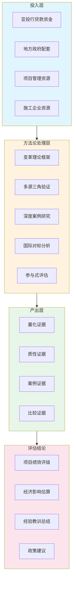
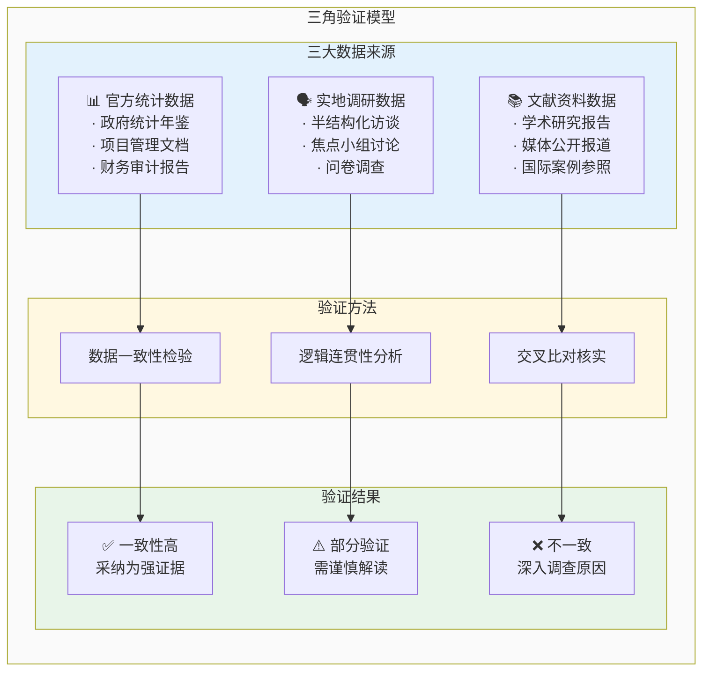
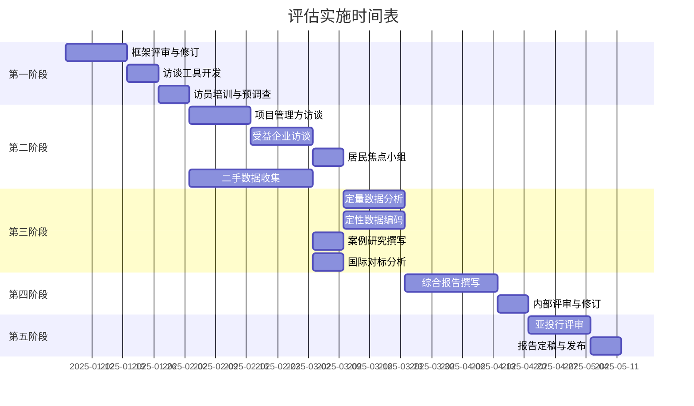
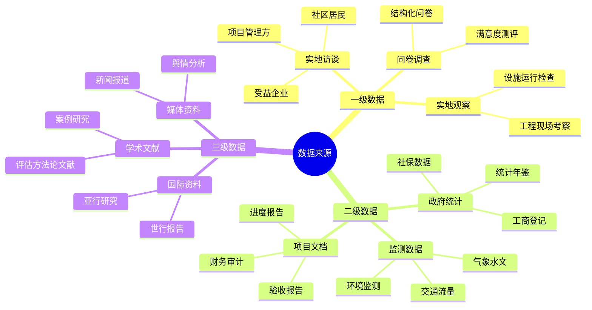
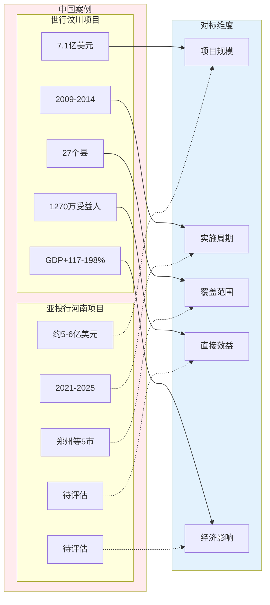
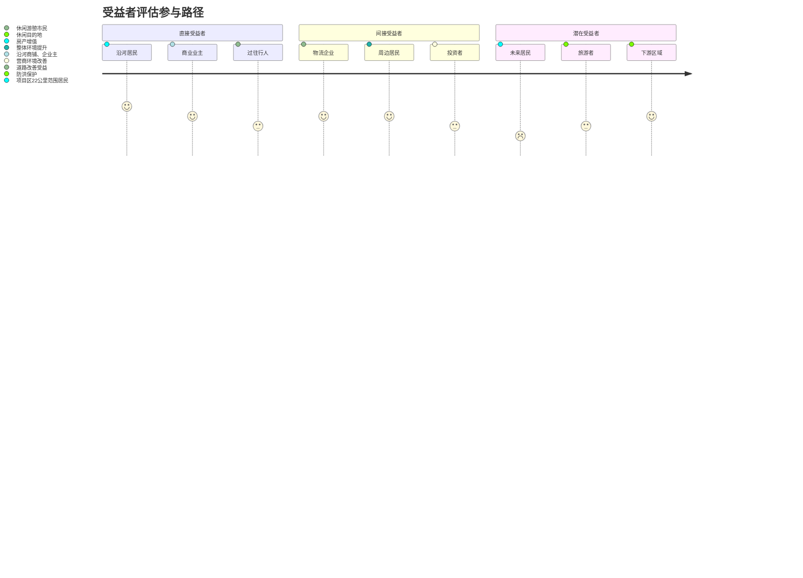
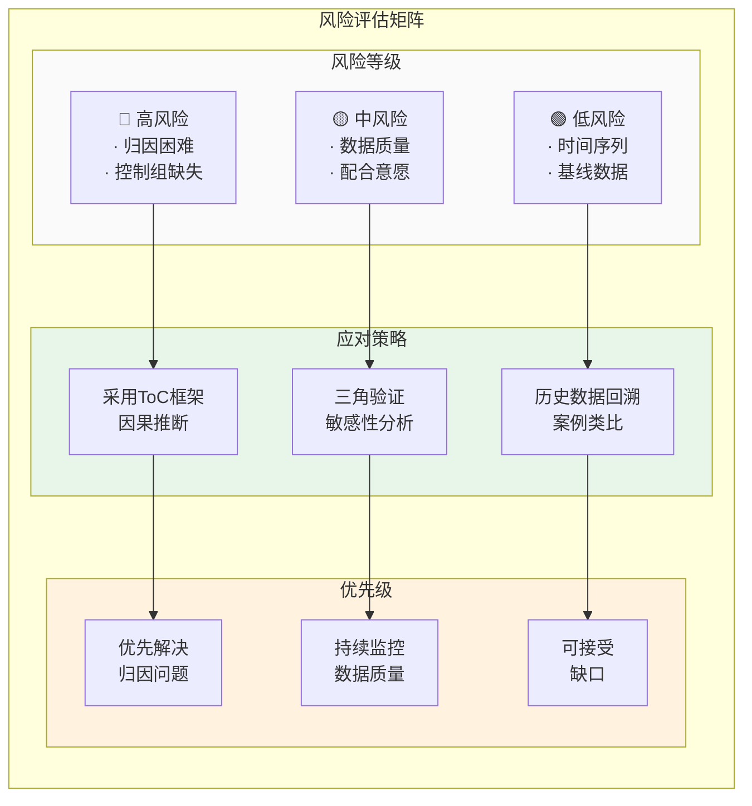

# 评估框架图表集

本附录收录了亚投行贷款河南灾后重建项目经济影响评估方法论框架中使用的各类图表，采用Mermaid语法绘制，可直接在支持Mermaid的Markdown编辑器中渲染查看。

---

## 目录

1. [评估方法论架构图](#1-评估方法论架构图)
2. [变革理论因果链图](#2-变革理论因果链图)
3. [三角验证模型图](#3-三角验证模型图)
4. [评估实施路线图](#4-评估实施路线图)
5. [数据来源分类图](#5-数据来源分类图)
6. [国际对标分析图](#6-国际对标分析图)
7. [受益者评估模型图](#7-受益者评估模型图)
8. [风险评估矩阵图](#8-风险评估矩阵图)

---

## 1. 评估方法论架构图

---

## 2. 变革理论因果链图

```mermaid
flowchart LR
    subgraph INPUT["投入 INPUT"]
        I1["亚投行贷款\n22.5亿元"]
        I2["地方政府配套"]
        I3["技术咨询"]
        I4["施工资源"]
    end

    subgraph ACTIVITIES["活动 ACTIVITIES"]
        A1["河道综合整治\n22.3公里"]
        A2["防洪设施建设\n8座闸坝"]
        A3["农村公路修复\n261万㎡"]
        A4["智慧管理系统"]
    end

    subgraph OUTPUT["产出 OUTPUT"]
        O1["防洪标准\n100年一遇"]
        O2["步道贯通\n22公里"]
        O3["服务设施\n完善"]
        O4["道路改善\n完成"]
    end

    subgraph SHORT["短期成果 SHORT-TERM"]
        S1["防洪能力提升"]
        S2["交通改善"]
        S3["生态提升"]
        S4["休闲空间增加"]
    end

    subgraph MEDIUM["中期成果 MEDIUM-TERM"]
        M1["企业投资增加"]
        M2["商业活力提升"]
        M3["就业机会增长"]
        M4["房产价值稳定"]
    end

    subgraph LONG["长期影响 LONG-TERM"]
        L1["区域经济发展"]
        L2["城市韧性增强"]
        L3["人居品质提升"]
        L4["可持续发展"]
    end

    INPUT --> ACTIVITIES
    ACTIVITIES --> OUTPUT
    OUTPUT --> SHORT
    SHORT --> MEDIUM
    MEDIUM --> LONG

    style INPUT fill:#1565c0,color:#fff
    style ACTIVITIES fill:#1976d2,color:#fff
    style OUTPUT fill:#42a5f5,color:#fff
    style SHORT fill:#66bb6a,color:#fff
    style MEDIUM fill:#ffa726,color:#fff
    style LONG fill:#ef5350,color:#fff
```

---

## 3. 三角验证模型图

---

## 4. 评估实施路线图

---

## 5. 数据来源分类图

---

## 6. 国际对标分析图

---

## 7. 受益者评估模型图

---

## 8. 风险评估矩阵图

---

## 图表使用说明

1. **渲染方式**：将本文件内容复制至支持Mermaid的Markdown编辑器（如Typora、VS Code + Mermaid插件、GitHub、飞书文档等）即可渲染显示

2. **复制使用**：如需将图表复制至其他文档，可直接复制对应Mermaid代码块，粘贴至目标编辑器

3. **图片导出**：如需导出为PNG/PDF，可使用以下方式：
   - 方式一：使用[Mermaid Live Editor](https://mermaid.live/)在线渲染后导出
   - 方式二：使用Typora等编辑器导出PDF

4. **图表修改**：直接编辑Mermaid代码即可修改图表样式和内容

---

**文档信息**

| 项目 | 内容 |
|-----|-----|
| 编制单位 | 河南省财政厅（国际金融组织贷款管理中心） |
| 版本 | V1.0 |
| 日期 | 2025年1月 |
| 用途 | 评估方法论框架图表支撑 |

---

*本图表集为《亚投行贷款河南灾后重建项目经济影响评估方法论框架》的配套文档。*
